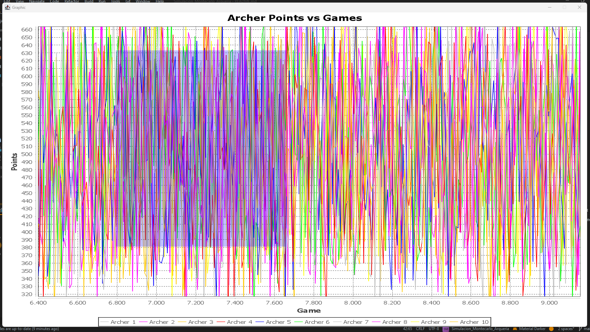

## Table of Contents
1. [General Info](#general-info)
2. [Technologies](#technologies)
3. [Installation](#installation)
4. [Running the Project](#running-the-project)
5. [Authors](#authors)
### General Info
***
This project gives a solution to the Monte Carlo problem where the idea at this point is to perform, using the MonteCarlo method, the simulation of an Archery game between two mixed teams of 5 participants each, generated in a pseudo-random way
pseudo-randomly, taking into account different characteristics for each of the players.
### Screenshot of the problem


## Technologies
***
A list of technologies used within the project:
* [JDK](https://www.oracle.com/co/java/technologies/downloads/#jdk20-windows): Version 20
* [Library JFreeChartFiles](https://sourceforge.net/projects/jfreechart/files/1.%20JFreeChart/): Version 1.0.19
* [Library JCommon](https://jar-download.com/artifacts/org.jfree/jcommon/1.0.23/source-code): Version 1.0.23
## Installation
***
A little intro about the installation.
```

$ git clone https://github.com/EstebanBarrero/GameArchers.git

```

## Running the Project
* Locate the project you just cloned and enter the folder.
  
* Open the project with the IDE or Development Environment you want, in my case I will use Intellij IDEA.
* Open Main.java class in the run package.
  
* Run the program with the Run File button at the top.

* Perfect, if everything goes well and if you followed the steps you should already be seeing the graphical interface of the application.

* Now, to generate the graph of all games and points, click on the Archer Score vs Games button.

* Within the graph remember that you can zoom in with the mouse.


Feel free to explore the interface and the application.

You can now generate your different archery games!!!
## Authors
* Jaider Castellanos
* Thomas Sorza
* Laura Vanesa Fernandez
* Esteban Puentes
* Brayan Fuquene

**Simulación de Computadores - Grupo 1**

**UPTC Tunja 2023 - 2**